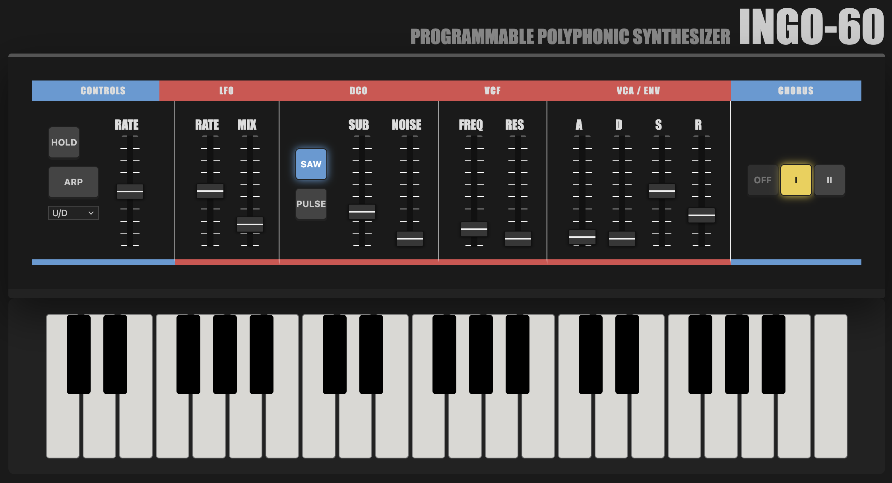

# INGO-60

### A Juno-Inspired Web Synth



A web-based synthesizer built with **Vite**, **React**, **TypeScript**, and **Tone.js**, inspired by the warm, immediate sound and workflow of the classic **Roland JUNO-60**.

This project explores how traditional subtractive synthesis can be re-imagined using modern web technologies and the Web Audio API — no plugins, no installs, just sound.

---

## Features

- Subtractive synthesis with oscillator, VCF and ADSR
- Polyphony with sub-oscillator and noise
- Arpeggiator with hold mode
- Chorus and LFO (vibrato)
- Playable with computer keyboard

**Runs entirely in the browser**

---

## Interface


The interface is inspired by classic 80s hardware synths:

- Flat layout
- Clear signal flow
- Immediate feedback

Form follows function.

---

## Getting started

1. Install dependencies:

```sh
npm install
```

2. Start development server:

```sh
npm run dev
```

See package.json for available scripts.

## Important files

- Main app: src/App.tsx
- Audio engine: src/audio/engine.ts
- Keyboard hook: src/hooks/useKeyboard.ts
- UI examples: src/components/KeyboardSection.tsx
- Types: src/types/synth.ts
- Vite config: vite.config.ts

## Usage

- Click the POWER ON button in the UI to initialize the audio context (required by browsers).
- Use the keyboard mapping defined in src/hooks/useKeyboard.ts to play notes.


---

## Tech Stack

| Technology        | Purpose                 |
| ----------------- | ----------------------- |
| **Vite**          | Fast dev server & build |
| **React**         | UI components           |
| **TypeScript**    | Type-safe codebase      |
| **Tone.js**       | Synthesis & timing      |
| **Web Audio API** | Low-level audio         |

---
